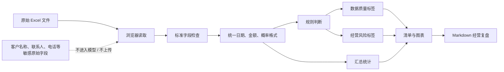
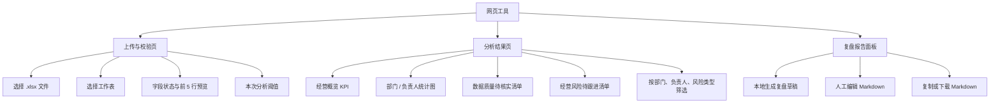
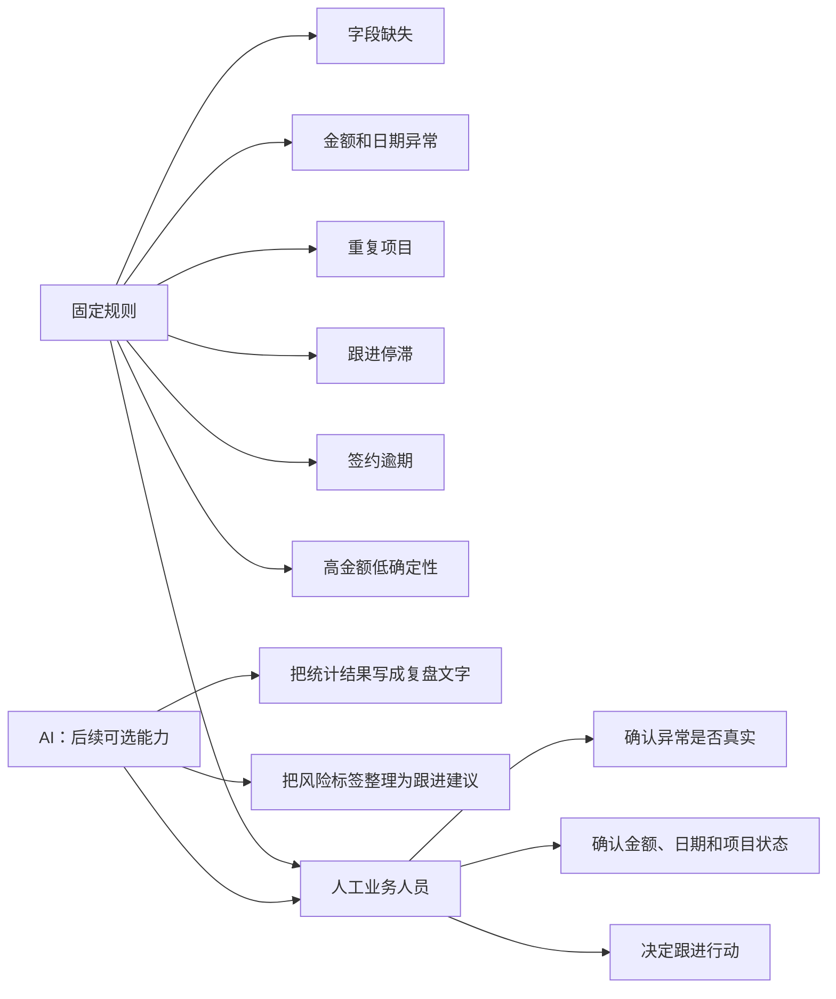
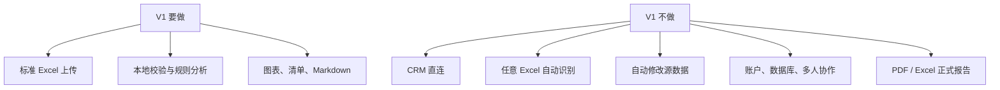

# CRM 储备项目运营复盘助手：产品流程与页面结构图

这不是网页视觉设计稿，而是先把“用户做什么、网页在哪一步处理什么、哪些数据不出浏览器”画清楚的逻辑图。

## 1. 用户使用流程

```mermaid
flowchart TD
    A[用户打开网页工具] --> B[上传 CRM 导出的 .xlsx]
    B --> C{文件和表头是否符合标准模板?}
    C -- 否 --> D[提示：缺少字段或文件无法读取]
    D --> B
    C -- 是 --> E[浏览器本地读取工作表]
    E --> F[预览前 5 行并确认分析阈值]
    F --> G[浏览器本地计算字段校验、统计与规则]
    G --> H[经营概览]
    G --> I[数据质量待核实]
    G --> J[经营风险待跟进]
    H --> K[用户筛选与查看项目明细]
    I --> K
    J --> K
    K --> L[本地生成 Markdown 复盘草稿]
    L --> M[用户编辑、复制或下载 Markdown]

    subgraph 浏览器本地，不上传原始 Excel
      E
      F
      G
      H
      I
      J
      K
      L
      M
    end
```

## 2. 一张 Excel 在网页里的处理路径



## 3. 网页页面结构



## 4. 规则和 AI 的分工



## 5. V1 边界


